## TrackbarDistance
### Выполняет Alexander
### HTML
```html
<mat-slider></mat-slider>
```
### Реализация
Через директиву gen-slider-distance принимает метку, которая будет отображаться возле текущего выбранного значения. <br>
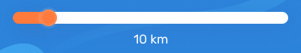

## Icon
### Выполняет Alexander
### HTML
```html
<gen-icon></gen-icon>
```
### Реализация
Принимает название иконки, и название размера:
<br>
name: string
<br>
size: SizeIcon(xxl, xl, l, m, s, xs, xxs) 
<br>
### Цвета
* accent – #061283
* warn – #FF7A3D
* snow – #FFFFFF
* segment – #DDE2E7
* accent-gradient – linear-gradient(90deg, #2C83DA 0%, #4AB7F8 100%)
### Размеры height: auto; width:
* xxl 40px
* xl 38px
* l 30px
* m 26px
* s 20px
* xs 16px
* xxs 11px <br>


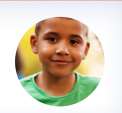

## Select
### Выполняет Alexander
### HTML
```html
<gen-select></gen-select>
```
### Реализация
Принимает массив опций для выбора, запрет на пустое поле (если выбор не задан, то выбранным станет первый элемент в списке опций).
Имеет исходящее событие выбора опции. <br>
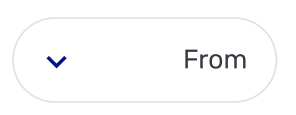
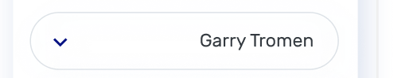
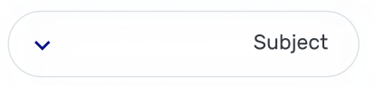
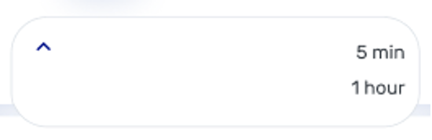

## CalendarWeek
### Выполняет Alexander
### HTML
```html
<gen-calendar-week></gen-calendar-week>
```
### Реализация
Компонент реализует `ControlValueAccessor` интерфейс,
сам генерирует дни недели в соответствии от текущей даты.
Имеет исходящее событие выбора даты.
На вход принимает выбранную дату.
<br>
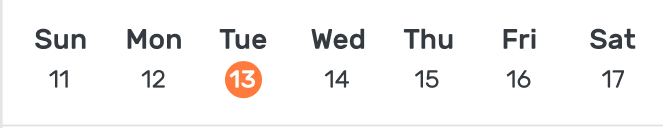

## Avatar
### Выполняет Alexander
### HTML
```html
<gen-avatar></gen-avatar>
```
### Реализация
Принимать путь к изображению и размер:
<br>
url: string;
<br>
size: AvatarSize('xxl' | 'xl' | 'l' | 'm');
* xxl 215x215
* xl 85x85
* l 55x55
* m 30x30. <br>


## Chip
### Выполняет Alexander
### HTML
```html
<gen-chip></gen-chip>
```
### Реализация
Принимает цвет и текст. Текст принимать через ng-content или входящий параметр. <br>
### Цвета
* accent – #061283
* good – #67AC5B
* segment – #DDE2E7

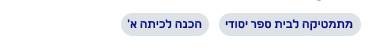

## InputSearch
### Выполняет Alexander
### HTML
```html
<gen-input-search></gen-input-search>
```
### Реализация
При активации данного компонента используя overlay отображать компонент с фоном на всю страницу ниже шапки.
Компонент отображает поле ввода, во время ввода текста излучать событие изменение текста. Принимать список опций для отображения вариантов выбора под элементом ввода. После выбора одного из вариантов излучить события выбора опции и прекратить отображение компонента. <br>
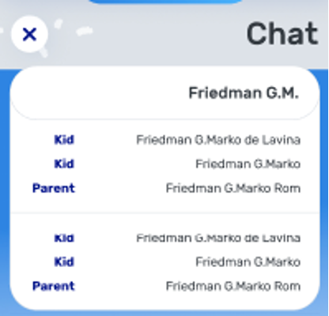

## BtnCorner
### Выполняет Dmitry
### HTML
```html
<button mat-flat-button disabled color="accent" genButton="corner">
  <gen-icon name="name"></gen-icon>
</button>
<button mat-flat-button color="primary" genButton="corner"></button>
<button mat-flat-button disabled color="accent" genButton="corner"></button>
```
### Директива
* genButton
### Реализация
* в Директиву **genButton** передавать значение **corner**
* Material Angular, для реализации необходим импорт нужного модуля
```ts
import {MatButtonModule} from '@angular/material/button';
```
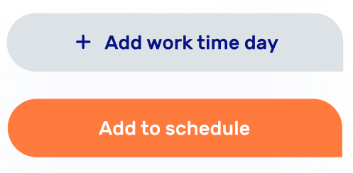
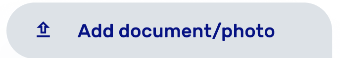

## BtnBottom
### Выполняет Dmitry
### HTML
```html
<button mat-flat-button color="primary" genButton="footer"></button>
```
### Директива
* genButton
### Реализация
* в Директиву **genButton** передавать значение **footer**
* в качестве атрибута передавать **mat-flat-button** 
* Material Angular, для реализации необходим импорт нужного модуля
```ts
import {MatButtonModule} from '@angular/material/button';
```


## BtnFab
### Выполняет Dmitry
### HTML
```html
<button mat-fab>
  <gen-icon color="accent"></gen-icon>
</button>
```
### Реализация
* в Директиву **genButton** передавать значение **footer**
* Material Angular, для реализации необходим импорт нужного модуля
```ts
import {MatButtonModule} from '@angular/material/button';
```

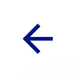

## BtnDot
### Выполняет Dmitry
### HTML
```html
<button mat-fab>
  <gen-icon name="name" color="subject-good"></gen-icon>
</button>
```
### Реализация
Material Angular, для реализации необходим импорт нужного модуля
```ts
import {MatButtonModule} from '@angular/material/button';
```
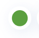

## Dot
### Выполняет Dmitry
### HTML
```html
<gen-dot></gen-dot>
```
### Директива
* color
### Цвета
* primary 
* warn
* accent
* good
* accent-gradient
* subject-accent
* subject-primary
* subject-warn
* subject-brown 
* subject-purple 
<br>


## Datepicker
### Выполняет Dmitry
### Реализация
Material Angular, для реализации необходим импорт нужного модуля
```ts
import {MatDatepickerModule} from '@angular/material/datepicker';
```
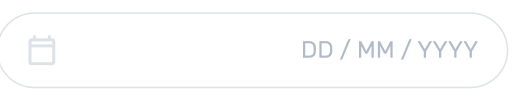

## Textarea
### Выполняет Dmitry
### Реализация
Material Angular, для реализации необходим импорт нужного модуля
```ts
import {MatFormFieldModule} from '@angular/material/form-field';
```
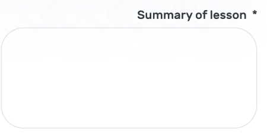

## Checkbox
### Выполняет Dmitry
### Директива
* genCheckbox
### Реализация
**genCheckbox** принимает имеет значение 'round'. Применяется для использования круглого checkbox'a <br>
Material Angular, для реализации необходим импорт нужного модуля
```ts
import {MatCheckboxModule} from '@angular/material/checkbox';
```


## InputLocation
### Выполняет Dmitry
### HTML
```html
<gen-input-location></gen-input-location>
```
### Реализация
При вводе пользователем адреса, подтягивается с сервера предложенные результаты <br>
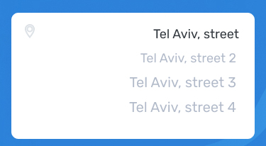
## Button
### Выполняет Dmitry
### Описание Директив
##### color
* primary - оранжевый
* warn - красный
* accent - синий
* accent-gradient - синий градиент
* good - зеленый
* subject-accent - синий для subject
* subject-primary - оранжевый для subject
* subject-warn - красный для subject
* subject-brown - коричневый для subject
* subject-purple - фиолетовый для subject
##### genBtn 
* corner
* footer
* transCorner

## Input
### Выполняет Vladimir
### HTML
```html
<gen-input></gen-input>
```
### Реализация
Данный компонент используется для ввода данных пользователем, определять функцию обработки вводных внешне используя атрибут и ввод/вывод заданного типа, функции в событии компонента. На данный момент реализован без использования angular material, пока не было времени сделать то же самое с конкретным компонентом https://material.angular.io/components/input/overview опишу, когда закончим с подготовкой.<br>


## SelectMultiple
### Выполняет Vladimir
### HTML
```html
<gen-select-multiple></gen-select-multiple>
```
### Реализация
Данный компонент drop down check-list при активации выводит список чек-боксов. Внутри компонента используеся список опций, выбор определяет значение <br>
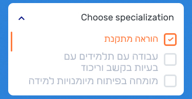

## Radiobutton
### Выполняет Vladimir
### HTML
```html
<mat-radio-group></mat-radio-group>
```
### Реализация
Данный компонент позволяет выбирать между двумя  возможными значениями переменной, название и функция определяется внешне через вход/выход компонента <br>
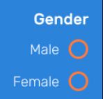

## ChatBubble
### Выполняет Vladimir
### HTML
```html
<gen-chat-bubble></gen-chat-bubble>
```
### Реализация
Данный компонент представляет из себя chat-bubble используемый в сhat flows в качестве вывода входных/выходных сообщений в чате <br>
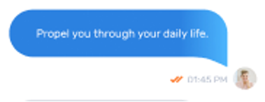

## Img
### Выполняет Vladimir
### HTML
```html
<gen-img></gen-img>
```
### Реализация
элемент с изображением и текстом. Изображения находятся в папке и отопрожаются внешне. тег в данном случае подразумеват отдельный набор элементов в отдельной директории, в виде маленьких компонентов, или могут верстаться внешне, но делать их отдельным набором, подразумевает что вероятно такой элемент может быть индивидуально-локально анимирован без лишнего кода внешне, что при необходимости позволяет использование уже имеющихся форм векторного дизайна. Изображение в таком случае передается внешне <br>


## Card
### Выполняет Vladimir
### HTML
```html
<gen-card></gen-card>
```
### Реализация
элемент с изображением и текстом. Изображение и текст передается внешне  <br>


## TextList
### Цвета: 
<ul>
<li> dark-light – #343A40 </li>
<li> dark – #000 </li>
<li> accent – #061283 </li>
<li> notify – #BEDDFC </li>
<li> dateout – #c2c2c2</li>
<li> warn – #FF7A3D</li>
<li> primary – #fff</li>
</ul>

### Размеры:
<ul>
<li> 45px: H1 </li>
<li> 35px: H2 </li>
<li> 30px: H3 </li>
<li> 25px: H4 </li>
<li> 20px: H5 </li>
<li> 18px: H6 </li>
<li> 16px: (span class="H7") </li>
<li> 15px: (span class="H8") </li>
<li> 14px: (span class="H9") </li>
<li> 12px: (span class="H10") </li>
</ul>

### Толщина:
<ul>
<li> 500 </li>
<li> 300 </li>
<li> 400 </li>
<li> 700 </li>
</ul>

### Положение: 
* center
* right

# Все Цвета: 
<ul>
<li>dark-light – #343A40</li>
<li>dark – #000</li>
<li>accent – #061283</li>
<li>notify – #BEDDFC</li> 
<li>dateout – #c2c2c2</li>
<li>warn – #f44336</li>
<li>snow – #fff</li>
<li>mainbg – #2C83DA</li>
<li>segment – #DDE2E7</li>
<li>checkbox-disabled – #569CE1</li>
<li>good – #67AC5B</li>
<li>primary - #FF7A3D</li>
<li>subject-accent - #4252AF</li>
<li>subject-primary - #F09D37</li> 
<li>subject-warn - #D53B64</li>
<li>subject-brown - #73564A</li>
<li>subject-purple -#8F36AA</li>
</ul>

## Список UI KIT
```html
<gen-icon></gen-icon>
<gen-img></gen-img>
<gen-dot></gen-dot>
<gen-input></gen-input>
<gen-select></gen-select>
<gen-select-multiple></gen-select-multiple>
<gen-card></gen-card>
<gen-avatar></gen-avatar>
<gen-radio-button></gen-radio-button>
<gen-input-location></gen-input-location>
<gen-trackbar-distance></gen-trackbar-distance>
<gen-chat-bubble></gen-chat-bubble>
<gen-chip></gen-chip>
<gen-calendar-week></gen-calendar-week>
<gen-input-search></gen-input-search>
```

## Выполняет Alexander
```html
<gen-icon></gen-icon>
<gen-select></gen-select>
<gen-calendar-week></gen-calendar-week>
<gen-input-search></gen-input-search>
<gen-avatar></gen-avatar>
<gen-trackbar-distance></gen-trackbar-distance>
<gen-chip></gen-chip>
```

## Выполняет Dmitry
```html
<button></button>
<gen-input-location></gen-input-location>
<gen-dot></gen-dot>
```

## Выполняет Vladimir
```html
<gen-input></gen-input>
<gen-select-multiple></gen-select-multiple>
<gen-img></gen-img>
<gen-card></gen-card>
<gen-radio-button></gen-radio-button>
<gen-chat-bubble></gen-chat-bubble>
```
